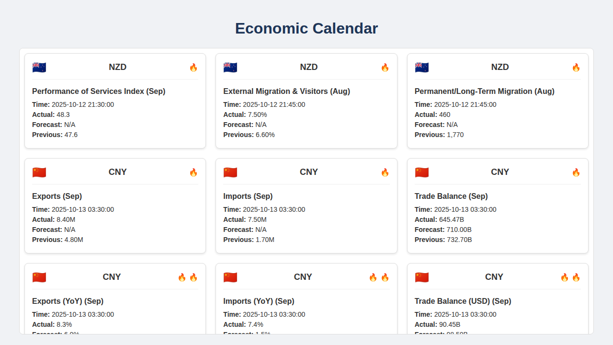

# (Forex) Economic Calendar - Python Edition

[](https://www.python.org/)
[](https://flask.palletsprojects.com/)

This project is a Python-based web application that displays economic calendar data for the Forex market. It presents the data in a clean, modern, and user-friendly interface with scrollable cards.

Each card displays key economic event data, including the country's flag, the event name, and other relevant macroeconomic indicators.

**Note:** This application currently uses a static `data.json` file.

## Features
- **Python Backend:** The application is built with Flask, a lightweight and powerful Python web framework.
- **Static Data:** The application uses a local `data.json` file, making it fast and reliable.
- **Modern UI:** The frontend is designed with a clean, card-based layout that is easy to navigate and visually appealing.

## Installation

To get started, clone the repository and install the necessary dependencies.

1.  **Clone the repository:**
    ```bash
    git clone https://github.com/your-username/economic-calendar-api.git
    cd economic-calendar-api
    ```

2.  **Install Python dependencies:**
    ```bash
    pip install -r requirements.txt
    ```

## How to Use

Once the installation is complete, you can run the application with a single command:

```bash
python3 app.py
```

The application will be available at `http://127.0.0.1:5000/`. Open this URL in your web browser to see the economic calendar.

## Demo
Here is a screenshot of the application in action:

